# Website Status Checker — Implementation Plan

> [!IMPORTANT]
> **Development philosophy**: This plan is implemented **step by step**, with each step followed by a verification step to ensure everything is working, running, and tested before moving on. The core values are **QUALITY**, **MAINTAINABILITY**, and **READABILITY**.

A lightweight system tray application that periodically checks the availability of your websites and displays their status as colored indicators directly in the taskbar notification area.

---

## Technology Choice

**Go + systray** — chosen for this project.

| Criteria | Value |
|---|---|
| **Language** | Go |
| **Tray library** | `github.com/getlantern/systray` |
| **Config format** | YAML (`gopkg.in/yaml.v3`) |
| **Binary size** | ~8–12 MB |
| **Memory (idle)** | ~10–20 MB |
| **Startup time** | Instant |
| **Cross-platform** | Win / Mac / Linux from single codebase |
| **Distribution** | Single `.exe`, no runtime dependencies |

---

## High-Level Architecture

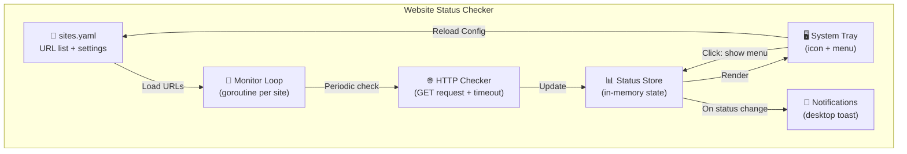

### How It Works

1. **On startup**: Load `sites.yaml`, start background goroutines for each site
2. **Every 30 seconds** (configurable): Perform HTTP GET on each URL, record status code + response time
3. **Update tray icon**: Aggregate all statuses → green (all up), yellow (some down), red (all down)
4. **Tray tooltip**: Shows summary (e.g., "3/3 sites up")
5. **Tray menu** (click): Shows each site with a ● green/red indicator + response time
6. **Menu items**: "Refresh Now", "Reload Config", separator, "Quit"
7. **On status change**: Desktop notification (Phase 5)

---

## URL Management — Config File: `sites.yaml`

```yaml
# Website Status Checker Configuration

settings:
  check_interval: 30        # seconds between checks
  request_timeout: 10       # seconds before marking a site as down
  notify_on_change: true    # desktop notification when status changes

sites:
  - name: "My Portfolio"
    url: "https://valentindumas.com"
    expected_status: 200
    check_interval: 10

  - name: "VSDP Productions"
    url: "https://vsdpproductions.com"

  - name: "Craft Agents"
    url: "https://craft-agents.com"
```

> The tray menu includes a **"Reload Config"** item to hot-reload `sites.yaml` without restarting the application.

### Reference Documents

- [URL management comparison](file:///s:/IdeaProjects/website-status-checker/docs/url-management-comparison.md) — why YAML was chosen over alternatives
- [Monitoring approach comparison](file:///s:/IdeaProjects/website-status-checker/docs/monitoring-approach-comparison.md) — simple vs. pooling vs. worker pool vs. queue
- [Authentication strategies](file:///s:/IdeaProjects/website-status-checker/docs/authentication-strategies.md) — auth types explained with use cases
- [Sample auth config](file:///s:/IdeaProjects/website-status-checker/docs/sample-auth-config.yaml) — example YAML for protected endpoints (for future use)

---

## Phase 1 — Project Setup & Config Loading

> **Goal**: Compilable Go project that loads and validates `sites.yaml`.

### Low-Level Design — Phase 1

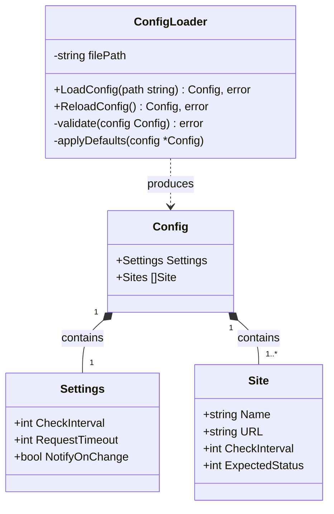

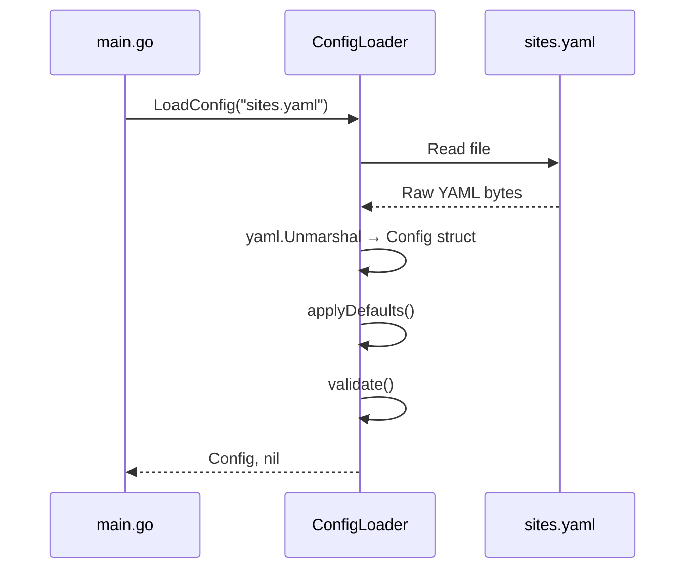

### Files

#### [NEW] `go.mod`

Go module definition with dependencies:
- `github.com/getlantern/systray`
- `gopkg.in/yaml.v3`

#### [NEW] `sites.yaml`

Default configuration with your real sites (Portfolio, VSDP Productions, Craft Agents).

#### [NEW] `internal/config/config.go`

- `Config`, `Settings`, `Site` structs with YAML tags
- `LoadConfig(path string) (*Config, error)` — read + unmarshal + validate
- `applyDefaults()` — fill missing optional fields with sensible values
- `validate()` — ensure required fields (name, URL) are present, URL is valid

### ✅ Verification — Phase 1

- `go build ./...` compiles without errors
- Unit tests for `config.go`: valid YAML, invalid YAML, missing file, default values, validation errors
- Run: `go test ./internal/config/...`

---

## Phase 2 — HTTP Health Checker

> **Goal**: A tested checker module that can probe a URL and return structured results.

### Low-Level Design — Phase 2

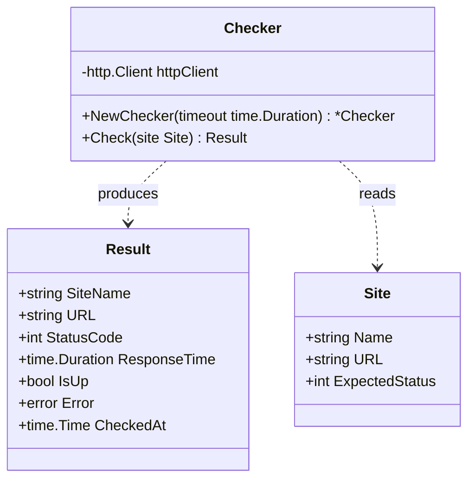

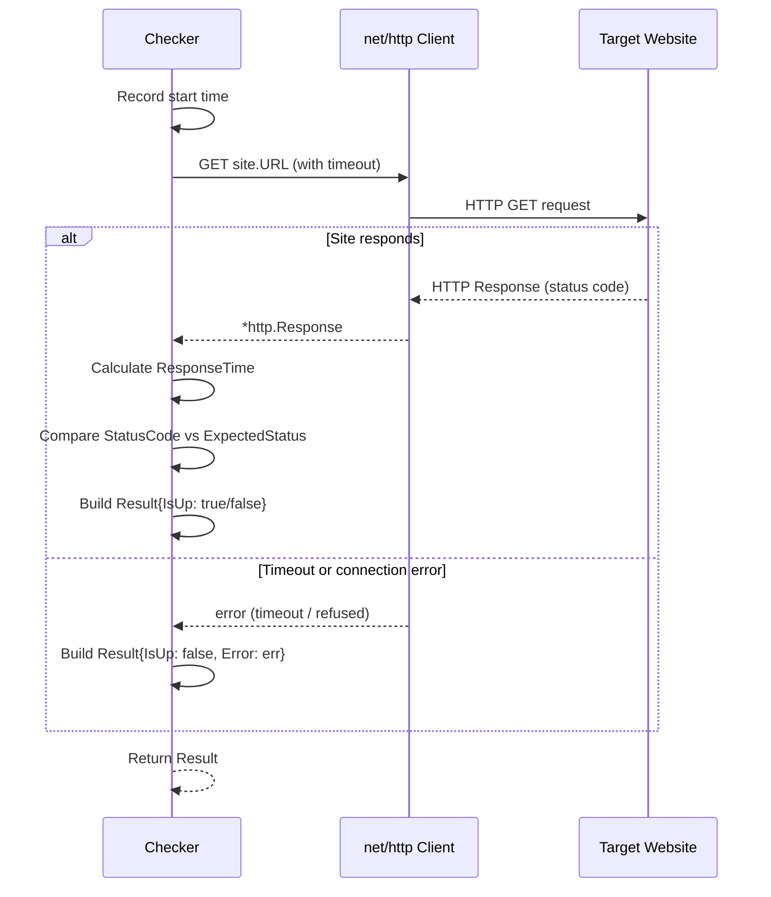

### Files

#### [NEW] `internal/checker/checker.go`

- `Checker` struct wrapping `http.Client` with configurable timeout
- `NewChecker(timeout time.Duration) *Checker`
- `Check(site config.Site) Result` — performs GET, measures response time
- `Result` struct: `SiteName`, `URL`, `StatusCode`, `ResponseTime`, `IsUp`, `Error`, `CheckedAt`
- IsUp logic: if `ExpectedStatus` is set, match exactly; otherwise accept any `2xx`
- Follows redirects, validates TLS

### ✅ Verification — Phase 2

- Unit tests with `httptest.NewServer` (mock HTTP server)
- Test cases: 200 OK, 500 error, timeout, connection refused, redirect, custom expected status
- Run: `go test ./internal/checker/...`

---

## Phase 3 — Monitoring Engine

> **Goal**: Background monitor that periodically checks all sites and maintains state.

### Low-Level Design — Phase 3

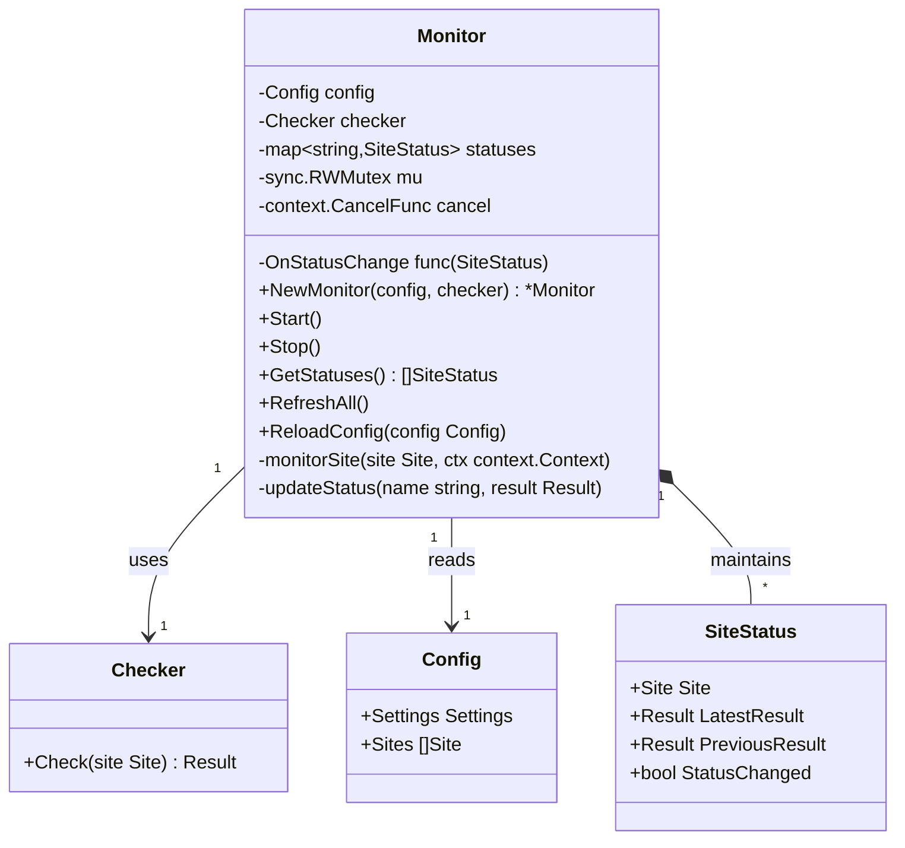

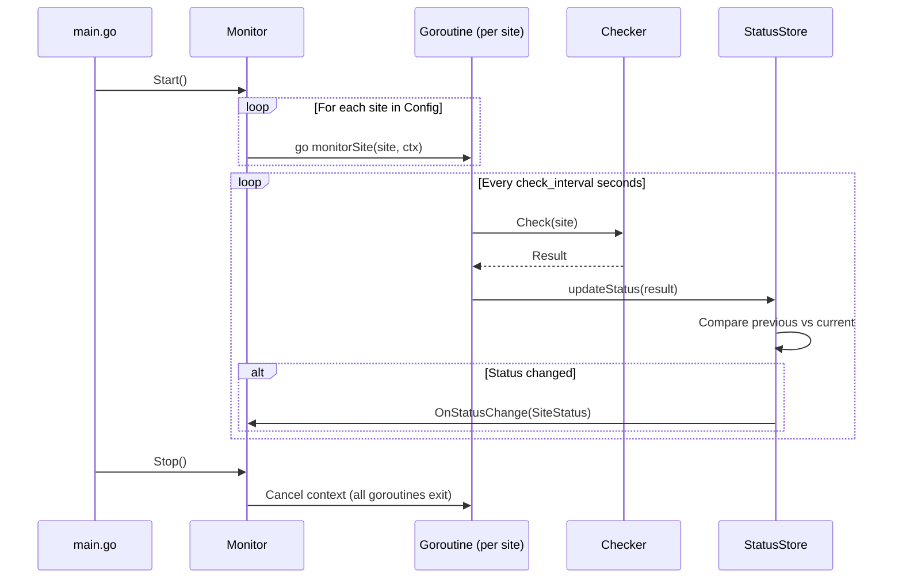

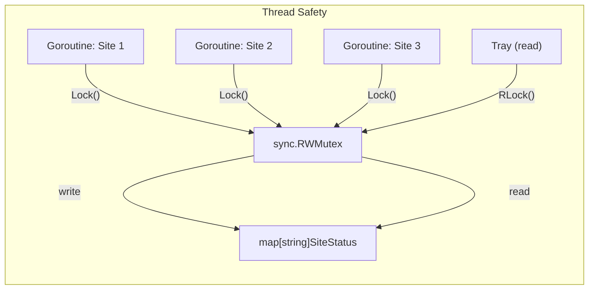

### Files

#### [NEW] `internal/monitor/monitor.go`

- `Monitor` struct with config, checker, and thread-safe status map
- `NewMonitor(config *Config, checker *Checker) *Monitor`
- `Start()` — launches one goroutine per site using `context.Context` for cancellation
- `Stop()` — cancels context, waits for goroutines to exit
- `monitorSite()` — per-site loop: check → update → sleep
- `updateStatus()` — acquire write lock, update map, detect status change
- `GetStatuses() []SiteStatus` — acquire read lock, return copy
- `RefreshAll()` — trigger immediate check on all sites
- `ReloadConfig(config *Config)` — stop all goroutines, restart with new config
- `OnStatusChange` callback — invoked on up→down or down→up transitions

### ✅ Verification — Phase 3

- Unit tests: start/stop lifecycle, status updates, concurrent access safety
- Integration test: monitor with mock HTTP endpoints, verify state transitions
- Test status change detection: mock server toggles between 200 and 500
- Run: `go test ./internal/monitor/...`

---

## Phase 4 — System Tray UI

> **Goal**: Working tray application with icon, tooltip, and menu on Windows.

### Low-Level Design — Phase 4

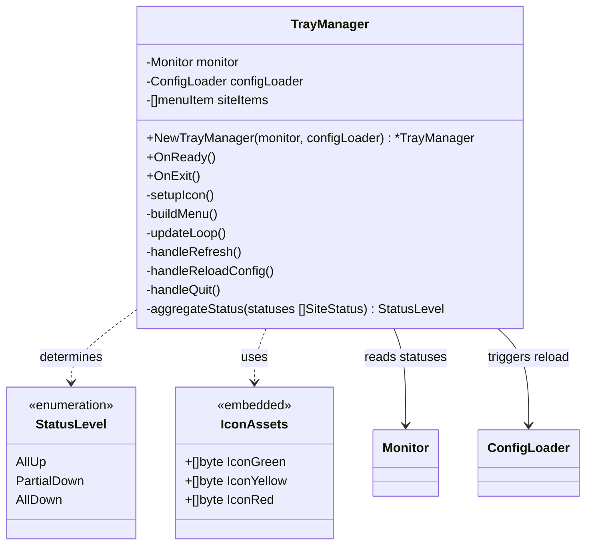

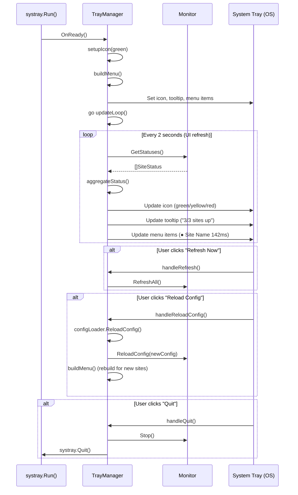

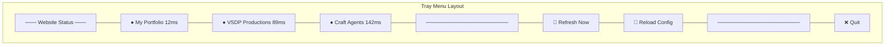

### Files

#### [NEW] `assets/icon_green.ico`, `assets/icon_yellow.ico`, `assets/icon_red.ico`

Tray icon assets (16×16 and 32×32 `.ico`):
- 🟢 Green = all sites up
- 🟡 Yellow = some sites down
- 🔴 Red = all sites down
- Embedded in binary via `//go:embed`

#### [NEW] `internal/tray/tray.go`

- `TrayManager` struct coordinating monitor and UI
- `OnReady()` — called by systray, sets up icon + menu + starts update loop
- `OnExit()` — cleanup on quit
- `buildMenu()` — dynamically creates menu entries from config
- `updateLoop()` — polls monitor every 2s, updates icon/tooltip/menu text
- `aggregateStatus()` — returns `AllUp` / `PartialDown` / `AllDown`
- Menu handlers: Refresh Now, Reload Config, Quit

#### [NEW] `main.go`

Application entry point:
- Load config → create checker → create monitor → create tray manager
- `systray.Run(trayManager.OnReady, trayManager.OnExit)`
- Graceful shutdown on Quit

### ✅ Verification — Phase 4

- Build: `go build -ldflags="-H=windowsgui" -o status-checker.exe`
- Manual test: tray icon appears with green icon
- Tooltip shows "Website Status: 3/3 sites up"
- Menu shows all 3 sites with ● green indicators and response times
- Stop one site (edit URL to invalid) → icon turns yellow, menu shows ● red for that site
- Use "Reload Config" → verify changes apply without restart
- Use "Refresh Now" → verify immediate check
- Use "Quit" → verify clean exit, no zombie processes

---

## Phase 5 — Desktop Notifications

> **Goal**: Toast notifications on status changes (site goes down or recovers).

### Low-Level Design — Phase 5

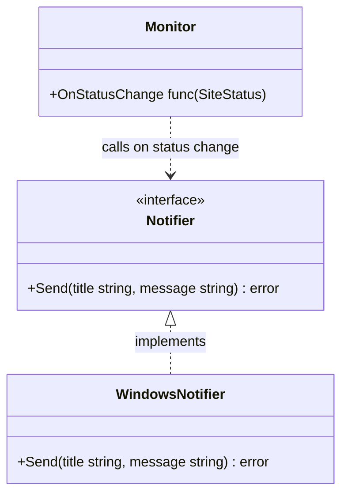

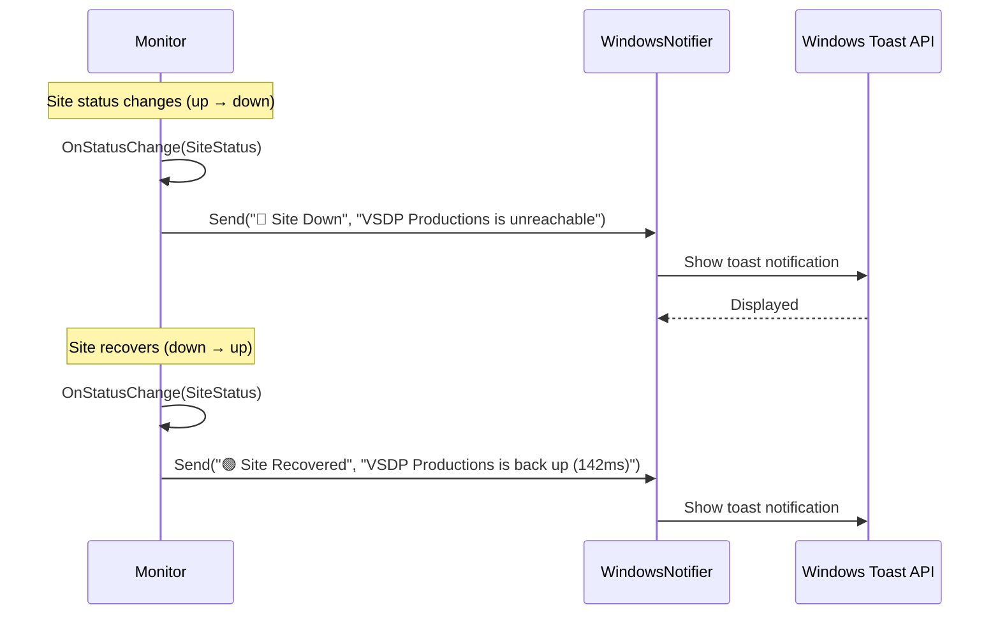

### Files

#### [NEW] `internal/notify/notify.go`

- `Notifier` interface: `Send(title, message string) error`
- `WindowsNotifier` struct implementing `Notifier`
- Uses `go-toast` library or PowerShell fallback
- Only triggers on transitions (up→down, down→up), never on stable states

#### [MODIFY] `internal/monitor/monitor.go`

- Wire `OnStatusChange` callback to Notifier

### ✅ Verification — Phase 5

- Edit `sites.yaml` to add a known-down URL → verify "Site Down" notification appears
- Fix the URL → verify "Site Recovered" notification appears
- Verify no duplicate notifications on consecutive checks with same status
- Run: `go test ./internal/notify/...`

---

## Phase 6 (Bonus) — Auto-Start on Boot

> Nice-to-have. Only implement if previous phases are solid.

### Low-Level Design — Phase 6

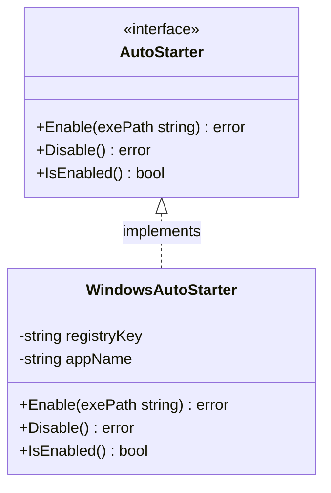

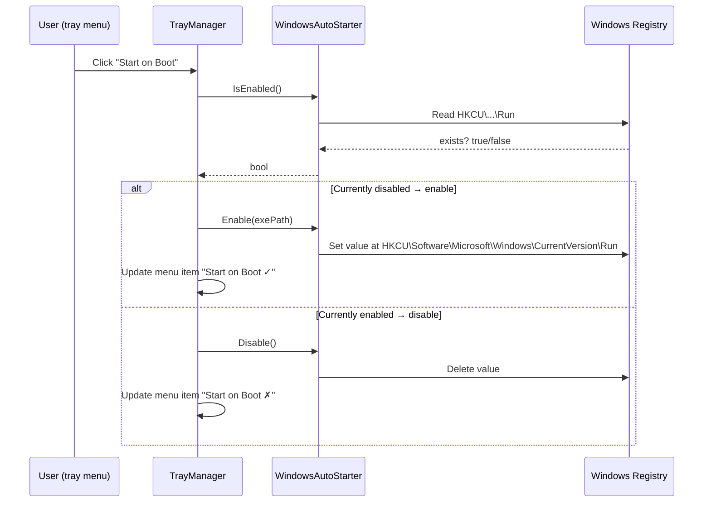

### Files

#### [NEW] `internal/autostart/autostart.go`

- `AutoStarter` interface for cross-platform future
- `WindowsAutoStarter`: reads/writes `HKCU\Software\Microsoft\Windows\CurrentVersion\Run`
- Toggle via tray menu item: "Start on Boot ✓/✗"

#### [MODIFY] `internal/tray/tray.go`

- Add "Start on Boot" toggle menu item before "Quit"

### ✅ Verification — Phase 6

- Toggle on → reboot → verify app starts automatically
- Toggle off → reboot → verify app does not start
- Verify registry key is correctly created/removed

---

## Cross-Platform Notes (Low Priority)

| Platform | Icon location | Menu behavior | Notification system | Auto-start |
|---|---|---|---|---|
| **Windows** | System tray (bottom-right) | Click → context menu | Windows Toast | Registry key |
| **macOS** | Menu bar (top-right) | Click → dropdown menu | Notification Center | LaunchAgent plist |
| **Linux** | Depends on DE (GNOME, KDE) | Click → context menu | `notify-send` / D-Bus | systemd user service |

> [!NOTE]
> The `getlantern/systray` library abstracts most platform differences. Cross-platform support mainly requires: (1) cross-compiling via `GOOS`/`GOARCH`, (2) platform-specific notification backends in `notify.go`, and (3) platform-specific auto-start registration.

---

## Project Structure

```
website-status-checker/
├── main.go                      # Entry point
├── go.mod                       # Module definition
├── go.sum                       # Dependency checksums
├── sites.yaml                   # User config (URLs to monitor)
├── PLAN.md                      # This implementation plan
├── docs/
│   ├── url-management-comparison.md      # Design decision: why YAML
│   ├── monitoring-approach-comparison.md  # Design decision: simple vs. pooling
│   ├── authentication-strategies.md       # Design reference: auth types
│   └── sample-auth-config.yaml            # Example: auth in sites.yaml
├── assets/
│   ├── icon_green.ico           # All sites up
│   ├── icon_yellow.ico          # Some sites down
│   └── icon_red.ico             # All sites down
├── internal/
│   ├── config/
│   │   └── config.go            # YAML config loader
│   ├── checker/
│   │   └── checker.go           # HTTP health checks
│   ├── monitor/
│   │   └── monitor.go           # Monitoring engine
│   ├── tray/
│   │   └── tray.go              # System tray UI
│   ├── notify/
│   │   └── notify.go            # Desktop notifications (Phase 5)
│   └── autostart/
│       └── autostart.go         # Auto-start on boot (Phase 6 bonus)
└── README.md
```

---

## Summary of Decisions

| Question | Decision |
|---|---|
| Technology | Go + systray |
| Config format | YAML file with hot-reload via tray menu |
| Check interval | 30 seconds default (10s for Portfolio) |
| Monitoring approach | Simple (one goroutine per site, < 20 sites) |
| Tray interaction | Click → menu only (KISS) |
| Tooltip | Summary: "3/3 sites up" |
| Authentication | Not needed now; reference docs + sample config saved for future |
| Notifications | Phase 5 — toast on status changes |
| Auto-start | Phase 6 — bonus, nice-to-have |
| Verification | At every phase, before moving on |
| Core values | Quality, Maintainability, Readability |
